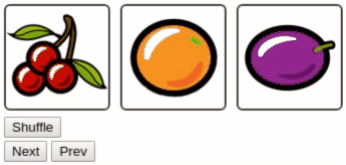

# stencil-jQuery-SlotMachine

A web component compiled with StencilJS to simulate a slot machine effect.



A [StencilJS](https://stenciljs.com/) project to generate a web component encapsulating the cool [jQuery-SlotMachine](https://github.com/josex2r/jQuery-SlotMachine) javascript library. 

## Cloning the repository

```
$ git clone https://github.com/albertorcf/stencil-jQuery-SlotMachine.git
$ cd stencil-slot-machine/
$ npm install
$ npm start
```

## Understanding the code

See *src/typings.d.ts* with the type definitions for the jQuery-SlotMachine javascript library.

Then whe can use it in *src/components/slot-machine/slot-machine.tsx* whit the following import:

```js
import SlotMachine from 'jquery-slotmachine/lib/slot-machine';
```

See also:

* *src/components/slot-machine/slot-machine.css* containing the style definitions
* *src/index.html* to test the component